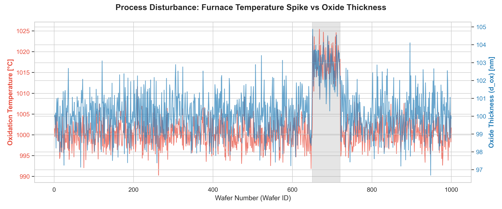
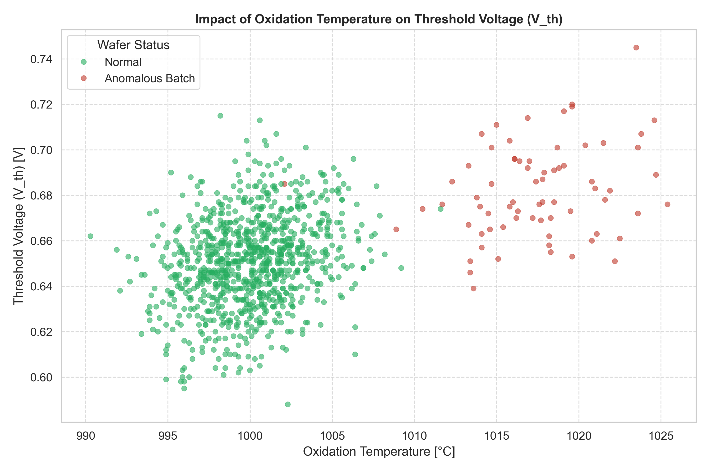
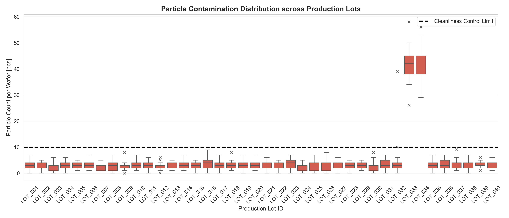
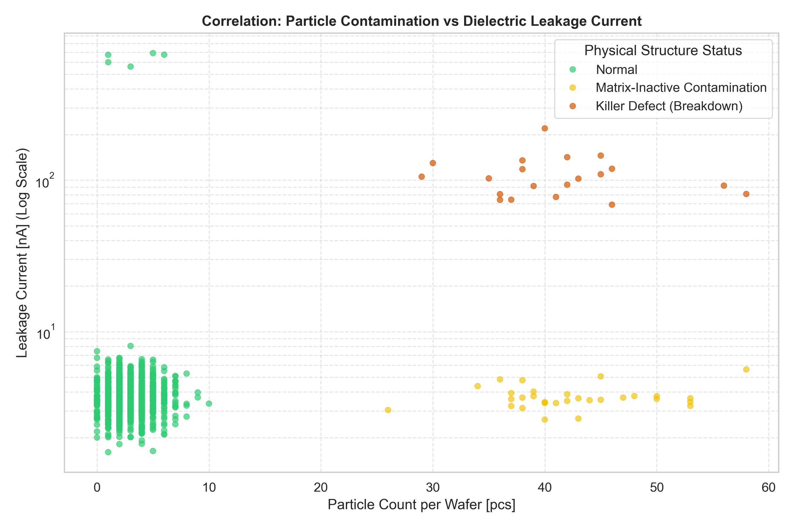
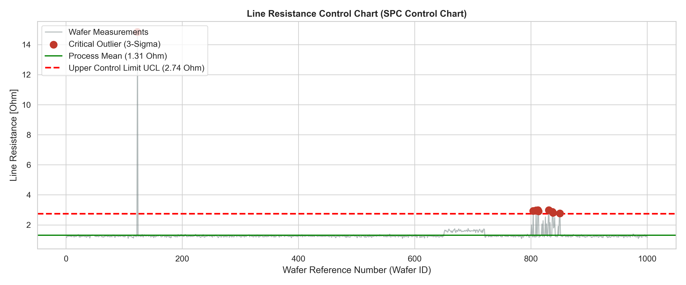
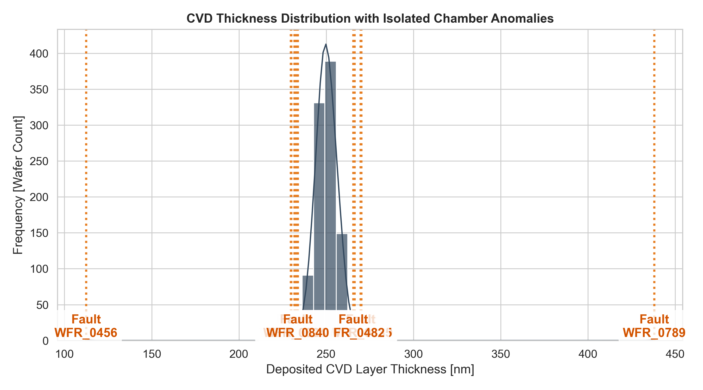
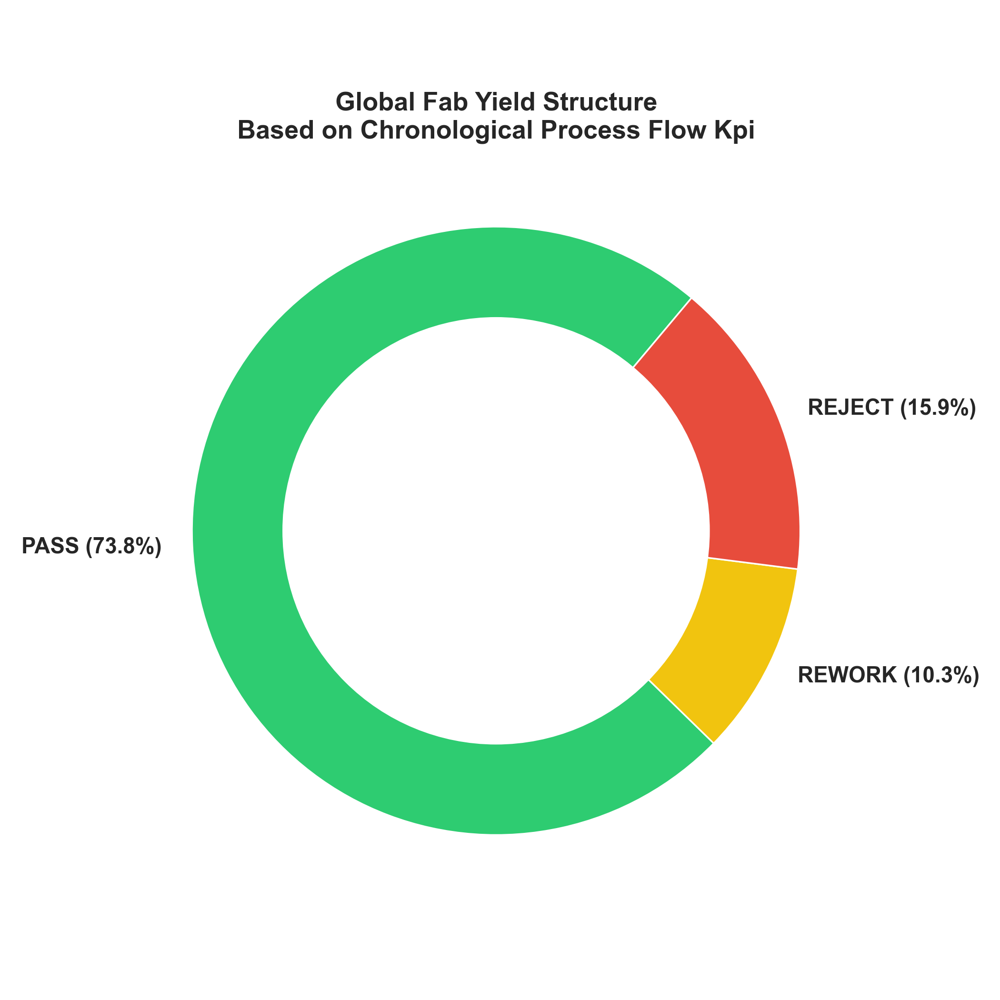

# MOS Yield Analysis & Process Control

## 1. Introduction and Project Goal

This project is an engineering case study in the field of **Yield Engineering** and Manufacturing Execution System (MES) data analysis. The goal of the project was to conduct a Root Cause Analysis based on raw telemetry data from a semiconductor fabrication plant, identify the physical causes of yield drops, and develop a wafer qualification system.

This project was created as a preparatory portfolio for the **"Hands-on training on Micro & Nano fabrication"** specialized course organized by **NCSR “Demokritos”** under the INFRACHIP initiative.

<div align="center">
  
</div>

## 2. Repository Structure

```text
├── /data
│   └── wafer_fab_data_raw.csv         
├── /source
│   ├── analysis1_temperature.py       
│   ├── analysis2_cleanroom_particles.py  
│   ├── analysis3_outlier_detection.py  
│   └── analysis4_qualification_system.py
├── /figures                            
└── README.md                          
```

## 3. Technological Background: Planar Process and MOS Diodes

The fabrication of structures such as MOS (Metal-Oxide-Semiconductor) diodes or capacitors relies on strict chronology. Our dataset records parameters from the following successive critical stages of the planar process:

`Wafer` $\rightarrow$ `Oxidation` $\rightarrow$ `Photolithography` $\rightarrow$ `Etching` $\rightarrow$ `CVD` $\rightarrow$ `Metallization` $\rightarrow$ `Electrical Testing`

Each of these steps is interdependent. Misalignment in **photolithography** affects **wet/dry etch** processes, and **CVD** chamber defects reflect in the final measurements at electrical characterization stations.

The 4 analyses below prove that I understand the correlation between process physics and the final operation of a MOS device.

## 4. Data Analysis and Engineering Investigation

### Act I: Oxidation Furnace Thermal Drift vs. MOS Physics

Data analysis of oxide thickness measurements and electrical tests revealed an anomaly for wafers in the 650–720 range. A temperature spike in the oxidation furnace led to uncontrolled dielectric oxide growth.

This phenomenon is perfectly explained by semiconductor physics. The threshold voltage of a MOS structure is described by the equation:

$$
V_{th} = \Phi_{ms} + 2\Phi_F - \frac{Q_{ox}}{C_{ox}} - \frac{Q_d}{C_{ox}}
$$

Where the unit capacitance of the oxide is $C_{ox} = \frac{\epsilon_{ox}}{d_{ox}}$. When the oxide thickness ($d_{ox}$) increases due to a furnace failure, the capacitance ($C_{ox}$) decreases, which directly forces a critical shift in the threshold voltage ($V_{th}$).

	
<div align="center"><sub><b>Figure 1.</b> Run-chart showing the sudden drift in oxidation temperature and its direct impact on oxide thickness.</sub></div>

<br>

<div align="center">
  
</div>
<div align="center"><sub><b>Figure 2.</b> Scatter plot correlating the anomalous oxidation temperature spike with the shift in threshold voltage.</sub></div>

<br>


### Act II: Cleanroom Cleanliness Classes and "Killer Defects"

During production, batches (e.g., LOT_032) were identified with a drastic increase in particulate matte


<div align="center">
  
</div>
<div align="center"><sub><b>Figure 3.</b> Boxplot identifying specific production lots that violated cleanroom particle limits.</sub></div>

<br>

<div align="center">
  
</div>
<div align="center"><sub><b>Figure 4.</b> Log-scale scatter plot demonstrating how excessive particle contamination causes critical dielectric leakage.</sub></div>


### Act III: Statistical Process Control (SPC) and Event-Driven Errors

Continuous errors (like furnace drift) are different from event-driven anomalies. Using the classic 3-sigma rule ($3\sigma$) and the Interquartile Range (IQR), I created filters to catch isolated physical damage to the wafer, such as a broken path (drastic resistance spike) or a temporary gas dispenser defect during Chemical Vapor Deposition (CVD).


<div align="center">
  
</div>
<div align="center"><sub><b>Figure 5.</b> SPC control chart applying the 3-sigma rule to detect critical line resistance outliers.</sub></div>

<br>

<div align="center">
  
</div>
<div align="center"><sub><b>Figure 6.</b> Histogram of CVD thickness distribution highlighting isolated chamber deposition anomalies.</sub></div>

### Act IV: Chronology-Based Yield Qualification Mask

The finale of the project was the implementation of a script simulating the decisions of an MES (Manufacturing Execution System). The script classifies wafers based on process chronology:

- **REWORK:** Mask alignment errors (Photolithography Alignment). According to engineering standards, a wafer ruined at this stage is not destroyed – the photoresist can be chemically stripped and re-exposed. Our code successfully saved **9.9%** of the production this way.

- **REJECT:** Oxidation errors, etching flaws, or resistance spikes are defects in the silicon structure (irreversible). These wafers were unconditionally scrapped.


<div align="center">
  
</div>
<div align="center"><sub><b>Figure 7.</b> Donut chart summarizing the final manufacturing yield based on the chronological qualification script.</sub></div>

## 5. Summary

This project demonstrates not only proficiency in data analysis using Python, but above all, a deep understanding of semiconductor physics, SPC methodology, and the behavior of MOS structures in the face of process imperfections.

Working with raw logs is the foundation of optimization, however, **full understanding of this technology requires moving from code to the cleanroom**. Theoretical knowledge of masks, wet/dry etching, metallization, and capacitance-voltage (C-V) testing has prepared me to safely and consciously begin hardware training. Participating in the **INFRACHIP NCSR “Demokritos”** program will be a natural, desired step, allowing me to verify these analytical models in a physical cleanroom while building a real MOS diode.
